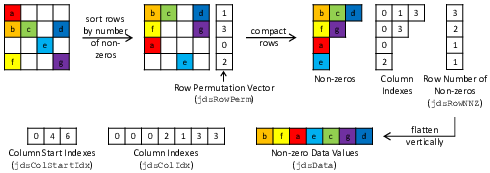

## Objective

Implementing a SpMV (Sparse Matrix Vector Multiplication) kernel for an input sparse matrix based
on the Jagged Diagonal Storage (JDS) transposed format. A diagram demonstrating the JDS transposed format is shown below:

